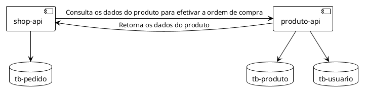
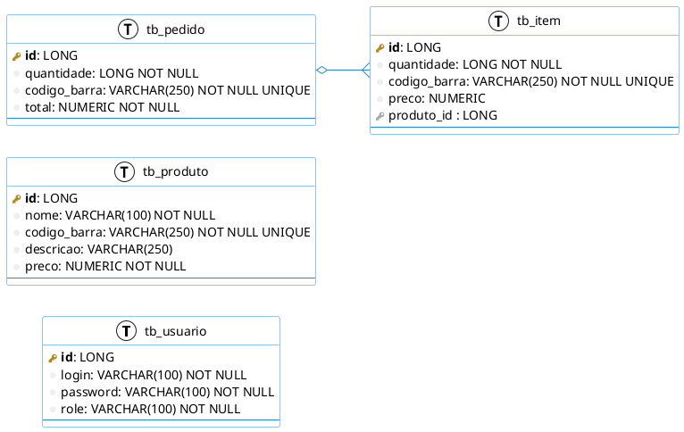
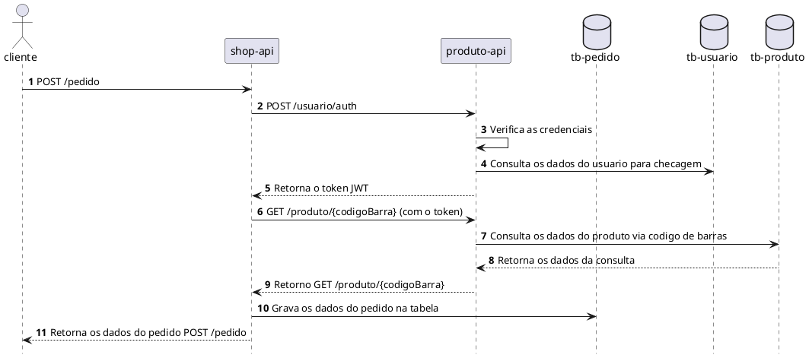

# Orquestração

```plantuml
@startuml
!theme plain

component shop_api as "shop-api"
component produto_api as "produto-api"
database tb_pedido as "tb-pedido"
database tb_produto as "tb-produto"
database tb_usuario as "tb-usuario"

shop_api -d-> tb_pedido
shop_api -> produto_api: Consulta os dados do produto para efetivar a ordem de compra
produto_api -d-> tb_produto
produto_api -d-> tb_usuario
produto_api -> shop_api: Retorna os dados do produto

@enduml
```

# Banco de dados

```plantuml
@startuml

!define primary_key(x) <b><color:#b8861b><&key></color> x</b>
!define foreign_key(x) <color:#aaaaaa><&key></color> x
!define column(x) <color:#efefef><&media-record></color> x
!define table(x) entity x << (T, white) >>

left to right direction
skinparam roundcorner 5
skinparam linetype ortho
skinparam shadowing false
skinparam handwritten false
skinparam class {
    BackgroundColor white
    ArrowColor #2688d4
    BorderColor #2688d4
}

table( tb_usuario ) {
  primary_key( id ): LONG 
  column( login ): VARCHAR(100) NOT NULL 
  column( password ): VARCHAR(100) NOT NULL
  column( role ): VARCHAR(100) NOT NULL
  ---
}

table( tb_produto ) {
  primary_key( id ): LONG 
  column( nome ): VARCHAR(100) NOT NULL 
  column( codigo_barra ): VARCHAR(250) NOT NULL UNIQUE
  column( descricao ): VARCHAR(250)
  column( preco ): NUMERIC NOT NULL
  ---
}

table( tb_pedido ) {
  primary_key( id ): LONG 
  column( quantidade ): LONG NOT NULL
  column( codigo_barra): VARCHAR(250) NOT NULL UNIQUE
  column( total ): NUMERIC NOT NULL
  ---
}

table( tb_item ) {
  primary_key( id ): LONG 
  column( quantidade ): LONG NOT NULL
  column( codigo_barra): VARCHAR(250) NOT NULL UNIQUE
  column( preco ): NUMERIC
  foreign_key( produto_id ) : LONG
  ---
}

tb_pedido o--{ tb_item

@enduml
```

# Fluxo de Efetivação de Compra

```plantuml
@startuml
autonumber

hide footbox

actor client as "cliente"
participant shop_api as "shop-api"
participant produto_api as "produto-api"
database tb_pedido as "tb-pedido"
database tb_usuario as "tb-usuario"
database tb_produto as "tb-produto"

client -> shop_api: POST /pedido
shop_api -> produto_api: POST /usuario/auth
produto_api -> produto_api: Verifica as credenciais
produto_api -> tb_usuario: Consulta os dados do usuario para checagem
produto_api --> shop_api: Retorna o token JWT
shop_api -> produto_api : GET /produto/{codigoBarra} (com o token)
produto_api -> tb_produto: Consulta os dados do produto via codigo de barras
tb_produto --> produto_api: Retorna os dados da consulta
produto_api --> shop_api: Retorno GET /produto/{codigoBarra}
shop_api -> tb_pedido: Grava os dados do pedido na tabela
shop_api --> client: Retorna os dados do pedido POST /pedido
@enduml
```
